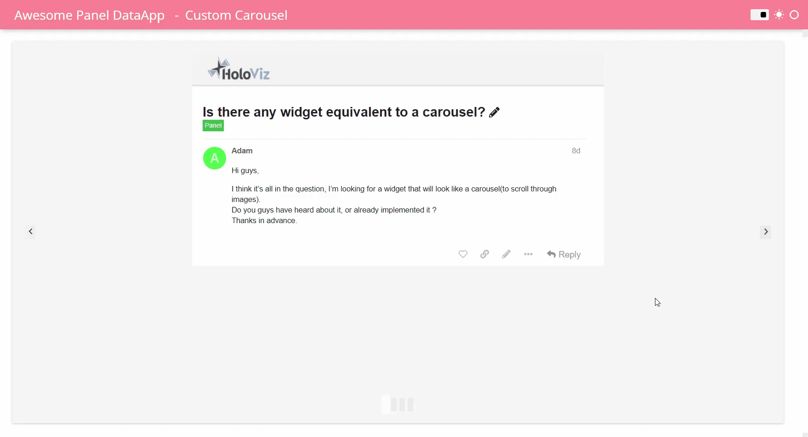

# Making your data, models and analytics awesome

APR 7, 2022
By Marc Skov Madsen, PhD, CFAⓇ

Interactive data exploration and data apps is a passion of mine.

I want to make it
easy for scientists, engineers, analysts, data scientists, domain experts and YOU to develop awesome, interactive data tools and apps using the *tools you know and love*.

That is why I ended up making lots of contributions to [Panel](https://panel.holoviz.org/) and the [HoloViz](https://holoviz.org) ecosystem. For example the [FastGridTemplate](https://panel.holoviz.org/reference/templates/FastGridTemplate.html#templates-gallery-fastgridtemplate) below.

[](https://awesome-panel.org/fast_grid_template)

... making two very popular sites awesome-streamlit.org and awesome-panel.org.

[](https://awesome-panel.org)

... and making popular Python packages like [panel-highcharts](https://github.com/MarcSkovMadsen/panel-highcharts) and [panel-chemistry](https://github.com/marcskovmadsen/panel-chemistry).

[](https://github.com/marcskovmadsen/panel-chemistry)

## How it all began

In 2019 I was transitioning from a project manager role to a role as [lead data scientist developer](https://orsted.com/) at Ørsted. I started learning Python and first step in that journey was figuring out how to productionize data and models using Python.

I started out creating applications using Django REST API on the backend and Angular in the frontend.


But I soon realized this was not a great solution. The main issues where

- a long *time to market*
- complexity of learning, developing and maintaining two technology stacks
- a long way from the users, domain experts and data scientists to the end product. They could not use the tools they know and love. We could not collaborate.

To solve these issues I started looking at pure Python data app frameworks.

I looked at [Dash](https://plotly.com/dash/), [Streamlit](https://streamlit.io/) and [Voila](https://github.com/voila-dashboards/voila). In the process I made [awesome-streamlit.org](https://awesome-stremlit.org) which has helped a lot of users get started with Streamlit and has +1100 stars on Github.

[](https://awesome-streamlit.org)

But none of these frameworks would support all of my use cases. I ended up looking at [Panel](https://panel.holoviz.org) and settled on that. You can check out my post [*I prefer Panel for my data apps*](https://medium.com/@marcskovmadsen/i-prefer-to-use-panel-for-my-data-apps-here-is-why-1ff5d2b98e8f) for the details.

## Making it work better

At the start of 2020 Panel was nothing like it is today. It needed to get feedback and improve.

So the first contributions I made to Panel where Github Issues ([my issues](https://github.com/holoviz/panel/issues?q=is%3Aissue+author%3AMarcSkovMadsen+)). Well prepared Github issues with context and a [minimum reproducible example](https://stackoverflow.com/help/minimal-reproducible-example) is a gift to an open source project. Luckily Philipp Rudiger and the other maintainers of the project had the time and energy to improve things.

One of my first requests ([#831](https://github.com/holoviz/panel/issues/831)) was for a [Discourse site for Panel and the HoloViz ecosystem](https://discourse.holoviz.org/) such that we could start building a community and a community knowledge base. Since then I've been helping users on discourse make cool tools and data apps. For example you can check out [Is there any widget equivalent to a carousel?](https://discourse.holoviz.org/t/is-there-any-widget-equivalent-to-a-carousel/3431).

[](https://discourse.holoviz.org/t/is-there-any-widget-equivalent-to-a-carousel/3431)

After the initial exploration next step was to create [awesome-panel.org](https://awesome-panel.org) to demonstrate what was possible and to push the development of Panel forward. Awesome-panel.org is of course one big, multi page app build using Panel.

[](https://awesome-panel.org)

The site now contains a large collection of data apps with code for inspiration. Check out the [App Gallery](https://awesome-panel.org/gallery).

[](https://awesome-panel.org/gallery)

The site also contains an awesome list on steroids for inspiration. Check out the [Awesome List](https://awesome-panel.org/awesome_list)

[](https://awesome-panel.org/awesome_list)

## Making it look better

One of the things that was holding back Panel was the look and feel. Streamlit had an easy to use, great looking template. Panel needed that as well. So I forced my self into the world of html, css and javascript to contribute the [FastListTemplate](https://panel.holoviz.org/reference/templates/FastListTemplate.html). You can see it in action below.


```python
import panel as pn
import pandas as pd
import hvplot.pandas # Adds .hvplot method to Pandas Dataframes
from diskcache import FanoutCache

pn.extension(sizing_mode="stretch_width", template="fast")

ACCENT = "#db7093"
URL = "https://api.github.com/users/holoviz/repos?perpage=200"

pn.state.template.param.update(
    site="HoloViz",
    title="Stargazers Count ⭐",
    accent_base_color=ACCENT,
    header_background=ACCENT,
    font="Comic Sans MS",
)

cache = FanoutCache()

@cache.memoize(expire=60 * 60 * 24, name="repos")
def get_data():
    return pd.read_json(URL)

data = (
    get_data()[["name", "stargazers_count"]]
    .sort_values("stargazers_count", ascending=False)
    .head(10)
)
table = pn.panel(data, index=False)
plot = data.hvplot(x="name", kind="bar").opts(color=ACCENT)

pn.panel(
    """## Info ‍🎓

The app shows the `stargazers_count` on Github for the 10 most popular HoloViz repositories
"""
).servable(area="sidebar")
pn.Column("## Table", table).servable()
pn.Column("## Plot", plot).servable()
```

Later I contributed the [FastGridTemplate](https://panel.holoviz.org/reference/templates/FastGridTemplate.html). Check out the video [Probably the most powerful data app template in the world](https://youtu.be/_mv9xwwzWAA).

## Making Friends

Making it alone would not be possible. Sometimes I've only had the vision, but others where the makers. And now a lot of them are my friends.

For example I'm especially happy about the `panel serve --autoreload` that speeds up your development process when working in a `.py` file and the *Jupyter Panel Preview* that does the same when working in a notebook. Philipp Rudiger was the maker, I only had the idea.


Today I'm the owner of a Jupyter Hub for Market Trading at Ørsted and part of a team developing data platforms and applications in VS Code and PyCharm. I'm so happy to see that Panel today can support use cases across skill levels and development environments. WE CAN START TO COLLABORATE. This is a long term process. Making the PyData and Jupyter ecosystems as easy and fast to use as Excel takes time.

I would like to thank Maxime Liquet and Simon Høxbro Hansen for making a lot of the not so visible, but needed improvements to the HoloViz ecosystem and Panel in particular.

I would also like to thank Sophia Yang, who shares her passion for Panel and the HoloViz ecosystem on social media. You should definately check out her blog post [The easiest way to create an interactive dashboard in Python](https://towardsdatascience.com/the-easiest-way-to-create-an-interactive-dashboard-in-python-77440f2511d1) and follow her on [Medium](https://sophiamyang.medium.com/) and [Twitter](https://twitter.com/sophiamyang).

[](https://towardsdatascience.com/the-easiest-way-to-create-an-interactive-dashboard-in-python-77440f2511d1)

## Final Call to action

Please support Panel and awesome-panel.org by giving them a ⭐ on Github.

- [Panel Github](https://github.com/holoviz/panel)
- [awesome-panel.org Github](https://github.com/marcskovmadsen/awesome-panel)

Please follow me on [Twitter](https://twitter.com/MarcSkovMadsen) and [Linked In](https://www.linkedin.com/in/marcskovmadsen/) if you want to learn more about the things I make.

And if you have a passion for documentation, please consider helping Panel make awesome documentation. That is the next big step that needs to be taken.

Thanks for taking the time 👍

Marc Skov Madsen, PhD, CFAⓇ
